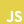
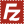

[![Cody Tolene][cody-tolene-intro-img]][cody-tolene-link]

## About

I'm Cody Tolene, a software engineer who especially enjoys full-stack development and Angular. My journey started back in the days of Flash and ActionScript, and now I focus on building clean, engaging web experiences. This GitHub is where I share tools, experiments, and personal projects. When I’m not coding, I’m a husband, dad, and lifelong learner who finds joy in mentoring others while constantly exploring new technologies. Thanks for checking out my profile—feel free to drop me a line sometime!

## Websites

| Link                                | Description                              |
| :---------------------------------- | :--------------------------------------- |
| [Cody Tolene][cody-tolene-link]     | Portfolio (kind of) website.             |
| [Pip-Boy][pip-boy-link]             | A Pip-Boy inspired terminal.             |
| [Lambda Guru][lambda-guru-link]     | Blog about software development.         |
| [My Game Stack][my-game-stack-link] | Video game catalog and social network.   |
| [Pro Angular][pro-angular-link]     | Angular development tools and resources. |
| [LinkedIn][linked-in-link]          | Professional networking.                 |

## Projects

|                                                                                                   Repo Logo                                                                                                    | Repo Link                                                      |
| :------------------------------------------------------------------------------------------------------------------------------------------------------------------------------------------------------------: | :------------------------------------------------------------- |
|                     [](https://github.com/CodyTolene/pip-apps)                     | https://github.com/CodyTolene/pip-terminal                     |
|                             [](https://github.com/CodyTolene/pip-apps)                              | https://github.com/CodyTolene/pip-apps                         |
|                           [](https://github.com/CodyTolene/3D-Printing)                            | https://github.com/CodyTolene/3D-Printing                      |
|                [](https://github.com/CodyTolene/Red-Portals)                | https://github.com/CodyTolene/Red-Portals                      |
|                     [](https://github.com/CodyTolene/Pico-Portal)                      | https://github.com/CodyTolene/Pico-Portal                      |
|         [](https://github.com/CodyTolene/Lambda-Cyberdeck-910)          | https://github.com/CodyTolene/Lambda-Cyberdeck-910             |
|                        [](https://github.com/ProAngular/pro-form)                         | https://github.com/ProAngular/pro-form                         |
|                     [](https://github.com/ProAngular/ngx-gist)                      | https://github.com/ProAngular/ngx-gist                         |
|                  [](https://github.com/ProAngular/ngx-scroll-top)                   | https://github.com/ProAngular/ngx-scroll-top                   |
| [](https://github.com/CodyTolene/Flipper-Zero-Development-Toolkit) | https://github.com/CodyTolene/Flipper-Zero-Development-Toolkit |
|        [](https://github.com/CodyTolene/Flipper-Zero-Camera-Suite)         | https://github.com/CodyTolene/Flipper-Zero-Camera-Suite        |
|                         [](https://github.com/CodyTolene/Unicorn-Pi)                         | https://github.com/CodyTolene/Unicorn-Pi                       |
|           [](https://github.com/CodyTolene/Unicorn-Pi-Galactic)            | https://github.com/CodyTolene/Unicorn-Pi-Galactic              |
|                         [](https://github.com/CodyTolene/Pocket-Pi)                          | https://github.com/CodyTolene/Pocket-Pi                        |

## Preferences

### Programming

<p float="left">
  
  
  
  
  
  
  
  
  
  
  
</p>

### Frameworks / Platforms

<p float="left">
  
  
  
  
  
  
  
  
  
  
  
  
  
  
  
</p>

### Libraries / Tools

<p float="left">
  
  
  
  
  
  
  
  
  
  
  
  
  
  
  
  
  
  
  
  
  
  
  
  
  
  
  
</p>

### Other

<p float="left">
  
  
  
  
  
  
  
  
  
  
  
  
  
  
  
  
  
  
  
  
  
  
  
</p>

## Contact / Contributions

Thank you for any contributions you make to my projects. Your support is greatly appreciated!

| Type                                                           | Info                                                           |
| :------------------------------------------------------------- | :------------------------------------------------------------- |
|             | webmaster@codytolene.com                                       |
|        | https://github.com/sponsors/CodyTolene                         |
|  | https://www.buymeacoffee.com/codytolene                        |
|    | bc1qfx3lvspkj0q077u3gnrnxqkqwyvcku2nml86wmudy7yf2u8edmqq0a5vnt |

<details>
  <summary>
    <b>
      Cody Tolene
      &#60;<a href="mailto:webmaster@codytolene.com">webmaster@codytolene.com</a>&#62;
    </b>
  </summary>
  
  ```
  God, grant me the serenity to accept the things I cannot change; courage to change the things I can; and wisdom to know the difference. Living one day at a time; enjoying one moment at a time; accepting hardships as the pathway to peace; taking, as He did, this sinful world as it is, not as I would have it; trusting that He will make all things right if I surrender to His Will; so that I may be reasonably happy in this life, and supremely happy with Him forever and ever in the next. Amen.
  ```
</details>

[cody-tolene-intro-img]: .github/images/cody-tolene-intro.gif
[cody-tolene-link]: https://www.codytolene.com
[lambda-guru-link]: https://www.lambda.guru
[linked-in-link]: https://www.linkedin.com/in/cody-tolene
[my-game-stack-link]: https://www.mygamestack.com
[pip-boy-link]: https://www.pip-boy.com
[pro-angular-link]: https://www.proangular.com
[simple-icons-link]: https://simpleicons.org/
